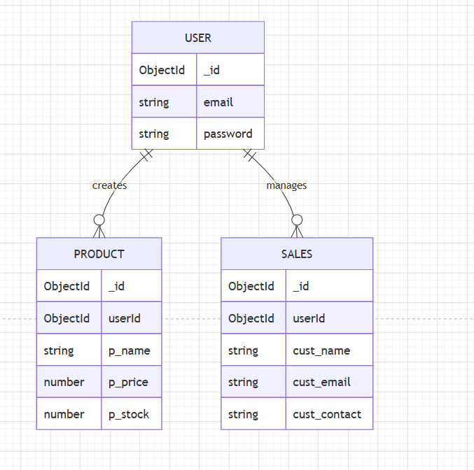

# AromaTrace

A modern full-stack inventory and batch traceability application developed as part of the **TBI GEU SIP 2026 – AI-Assisted Full Stack Development Internship**.

The application enables businesses to manage products, track inventory, maintain sales records, generate invoices, and create AI-powered product descriptions. It is built with a React frontend, Express REST API, and MongoDB Atlas database.

---

# Tech Stack

## Frontend

- React
- Vite
- Redux Toolkit
- Tailwind CSS
- Axios
- React Router DOM
- React Markdown

## Backend

- Node.js
- Express.js
- JWT Authentication
- Passport.js
- Express Validator
- Express Rate Limit
- REST API
- CORS
- Dotenv
- Google Gemini API

## Database

- MongoDB Atlas
- Mongoose ODM

## Tools

- Git & GitHub
- VS Code
- Postman
- MongoDB Compass
- Draw.io

---

# Project Structure

```text
AROMATRACE
│
├── Backend
│   ├── Controllers
│   ├── Db
│   ├── Middleware
│   ├── Models
│   ├── Routes
│   ├── .env
│   ├── .env.example
│   ├── .gitignore
│   ├── constants.js
│   ├── index.js
│   ├── package.json
│   ├── package-lock.json
│   ├── passport.js
│   ├── validation.js
│   └── README.md
│
├── Frontend
│   ├── public
│   ├── src
│   ├── .gitignore
│   ├── eslint.config.js
│   ├── index.html
│   ├── package.json
│   ├── package-lock.json
│   ├── postcss.config.js
│   ├── tailwind.config.js
│   ├── vite.config.js
│   └── README.md
│
├── images
│   └── schema_diagram.png
│
├── PROMPTS.md
└── README.md
```

---

# Features

- User Authentication (JWT)
- Google Login
- Product Management
- Product CRUD Operations
- Sales Management
- Invoice Generation
- Dashboard
- Product Search
- Stock Management
- MongoDB Atlas Integration
- RESTful APIs
- Redux State Management
- Backend Validation
- API Rate Limiting
- Responsive User Interface
- Authenticated Dashboard
- AI Product Description Generator
- Form Validation
- Loading & Error Handling
- Responsive Design (Mobile, Tablet & Desktop)

---

# AI Feature

The application includes an **AI-powered Product Description Generator** using the **Google Gemini API**.

## AI Workflow

- User enters the product name.
- Frontend sends the request to the backend.
- Backend calls the Gemini API.
- AI generates a professional product description.
- The generated description is displayed instantly inside the application.

## AI Features

- Generate AI Description
- Regenerate AI Description
- Loading State
- Error Handling
- Markdown Rendering

---

# Database

AromaTrace uses **MongoDB Atlas** with **Mongoose ODM**.

## Why MongoDB Atlas?

- Flexible document-based structure
- Cloud-based database
- Easy integration with Node.js and Express
- Suitable for product, user and sales data
- Easy development and scalability

## Database Schema

### User

```text
User
├── email
├── password
├── products
└── sales
```

### Product / Batch

```text
Product
├── p_name
├── p_price
├── p_stock
└── userId
```

### Sales

```text
Sales
├── cust_name
├── cust_email
├── cust_contact
├── cartItems
└── userId
```

## Schema Diagram



---

# REST API Documentation

All application APIs are exposed through the **`/api`** base path.

## Authentication APIs

### Register

**Endpoint:** `POST /api/register`

Registers a new user.

**Example Request:**

```json
{
  "email": "user@example.com",
  "password": "YourPassword@123"
}
```

**Example Response:**

```json
{
  "status": true,
  "message": "User registered successfully"
}
```

### Login

**Endpoint:** `POST /api/login`

Authenticates a registered user and creates an authentication cookie.

**Example Request:**

```json
{
  "email": "user@example.com",
  "password": "YourPassword@123"
}
```

**Example Response:**

```json
{
  "status": true,
  "message": "Login successful"
}
```

### Get User

**Endpoint:** `GET /api/getUser`

**Authentication:** Required

Returns authenticated user information.

### Logout

**Endpoint:** `GET /api/logout`

Clears the authentication cookie.

---

# Product / Batch APIs

### Get Products

**Endpoint:** `GET /api/products`

**Authentication:** Required

Returns products/batches belonging to the authenticated user.

### Insert Product / Batch

**Endpoint:** `POST /api/insert`

**Authentication:** Required

Creates a new product/batch.

**Example Request:**

```json
{
  "p_name": "Lavender Oil Batch A",
  "p_price": 1000,
  "p_stock": 1200
}
```

**Example Response:**

```json
{
  "status": true,
  "message": "Product inserted"
}
```

### Update Product

**Endpoint:** `POST /api/update`

**Authentication:** Required

Updates product/batch information.

### Delete Product

**Endpoint:** `POST /api/delete`

**Authentication:** Required

Deletes a product/batch.

---

# Sales APIs

### Get Sales

**Endpoint:** `GET /api/getsales`

**Authentication:** Required

Returns sales records for the authenticated user.

### Create Sale

**Endpoint:** `POST /api/createsales`

**Authentication:** Required

Creates a new sales record.

### Delete Sale

**Endpoint:** `POST /api/deletesales`

**Authentication:** Required

Deletes a sales record.

---

# AI API

### Generate Product Description

**Endpoint:** `POST /api/ai/suggestion`

Generates an AI-assisted product description using **Google Gemini**.

**Example Request:**

```json
{
  "prompt": "Generate a professional product description for Lavender Essential Oil."
}
```

---

# API Testing

The REST APIs were tested using **Postman**.

## Tested Functionality

- User Registration
- User Login
- Product Creation
- Product Retrieval
- Product Update
- Product Deletion
- Sales Creation
- Sales Retrieval
- Sales Deletion
- AI Product Description Generation

## Major API Demonstrations

- `POST /api/login`
- `POST /api/insert`

---

# Backend Setup

## 1. Clone the Repository

```bash
git clone https://github.com/abhi238466/AromaTrace.git
cd AromaTrace
```

## 2. Setup Backend

```bash
cd Backend
npm install
```

## 3. Configure Environment Variables

Create a **`.env`** file inside the `Backend` folder.

```env
MONGODB_URI=your_mongodb_connection_string
JWT_SECRET_KEY=your_secret_key
CORS_ORIGIN=http://localhost:5173
PORT=8000
GEMINI_API_KEY=your_gemini_api_key
GOOGLE_CLIENT_ID=your_google_client_id
GOOGLE_CLIENT_SECRET=your_google_client_secret
```

> **Important:** Never commit the real `.env` file, database credentials, API keys, client secrets, or other sensitive information to GitHub.

## 4. Run Backend

```bash
npm start
```

---

# Frontend Setup

Open a new terminal.

## 1. Navigate to Frontend

```bash
cd Frontend
```

## 2. Install Dependencies

```bash
npm install
```

## 3. Run Development Server

```bash
npm run dev
```

The frontend will be available at:

`http://localhost:5173`

---

# Architecture

```text
                         User
                           │
                           ▼
                 ┌─────────────────┐
                 │  React + Vite   │
                 │    Frontend     │
                 └────────┬────────┘
                          │
                          ▼
                 ┌─────────────────┐
                 │ Node.js +       │
                 │ Express REST API│
                 └────────┬────────┘
                          │
                 ┌────────┴─────────┐
                 │                  │
                 ▼                  ▼
        ┌────────────────┐  ┌────────────────┐
        │ MongoDB Atlas  │  │ Google Gemini  │
        │    Database    │  │     AI API     │
        └────────────────┘  └────────────────┘
```

---

# Production Deployment

AromaTrace is deployed using cloud hosting services.

## Frontend

**Hosting:** Vercel

**Live URL:**  
https://aroma-trace-gray.vercel.app

## Backend

**Hosting:** Render

**Live URL:**  
https://aromatrace-ghkh.onrender.com

## Database

**Database:** MongoDB Atlas

The production backend is connected to MongoDB Atlas.

---

# Production Architecture

```text
                         User
                           │
                           ▼
                    ┌────────────┐
                    │   Vercel   │
                    │   React    │
                    │  Frontend  │
                    └─────┬──────┘
                          │
                          ▼
                    ┌────────────┐
                    │   Render   │
                    │ Node.js +  │
                    │  Express   │
                    │    API     │
                    └─────┬──────┘
                          │
                 ┌────────┴─────────┐
                 │                  │
                 ▼                  ▼
        ┌────────────────┐  ┌────────────────┐
        │ MongoDB Atlas  │  │ Google Gemini  │
        │    Database    │  │     AI API     │
        └────────────────┘  └────────────────┘
```

Production CORS configuration and authentication cookies were configured to allow the deployed frontend and backend to communicate securely.

---

# Internship Progress

## Week 1 — Project Planning

- Project planning
- Problem identification
- GitHub repository setup
- Project brief preparation

## Week 2 — Frontend Foundation

- React + Vite setup
- Tailwind CSS integration
- Initial frontend structure
- Reusable components

## Week 3 — UI Design

- UI improvements
- Responsive design
- Component library
- Application wireframes

## Week 4 — Backend & API Integration

- Express backend development
- REST API development
- Postman API testing
- Frontend-backend integration

## Week 5 — Database & CRUD

- MongoDB Atlas integration
- Mongoose models
- CRUD operations
- Database schema design
- API verification

## Week 6 — Security & Validation

- JWT authentication
- OAuth integration
- Express Validator
- API rate limiting
- Authentication flow improvements

## Week 7 — AI Integration

- Google Gemini API integration
- AI product description generator
- Prompt engineering
- Markdown rendering
- Loading states
- Error handling
- `PROMPTS.md` documentation

## Week 8 — Application Integration

- Connected frontend with backend APIs
- Authenticated dashboard
- Complete CRUD user flows
- Frontend validation
- User feedback improvements
- AI feature UI polish
- Responsive UI
- Loading and error handling
- Network API verification

## Week 9 — Production Deployment

- Frontend deployed on Vercel
- Backend deployed on Render
- Production environment variables configured
- Production CORS configured
- Live frontend connected with live backend
- Production authentication verified
- CRUD operations verified on live deployment
- AI feature verified on live deployment
- README deployment details updated
- End-to-end testing completed

## Week 10 — Capstone & Finalization

- Final application review
- UI and responsive behaviour verification
- Critical bug verification and fixes
- Production deployment verification
- Comprehensive project documentation
- Final README preparation
- API documentation
- Architecture documentation
- Final repository cleanup
- Final project submission preparation

---

# Known Limitations

- Render free-tier services may spin down after inactivity.
- The first backend request after inactivity may take some time to respond.
- The application currently does not include role-based access control.
- Advanced analytics are not currently implemented.
- Product image upload is not currently implemented.

---

# Future Improvements

- Role-Based Access Control
- Admin Analytics Dashboard
- Product Image Upload
- Batch QR Code Generation
- Email Notifications
- Advanced Inventory Reports
- AI Batch Quality Analysis
- AI Sales Insights
- React Error Boundary
- Performance Optimization using `useMemo` and `useCallback`

---

# Credits & Acknowledgements

This project was developed as part of the:

**TBI GEU SIP 2026 – AI-Assisted Full Stack Web Development Internship**

Special thanks to the **TBI-GEU Skill Development Team** for the internship guidance, weekly tasks and learning resources.

## Technologies & Resources

- React
- Node.js
- Express.js
- MongoDB Atlas
- Google Gemini API
- Vercel
- Render
- Postman
- GitHub

AI-assisted development and debugging tools were used during development where appropriate.

---

# Final Project Links

## 🌐 Live Frontend

https://aroma-trace-gray.vercel.app

## 🔗 Backend API

https://aromatrace-ghkh.onrender.com

## 💻 GitHub Repository

https://github.com/abhi238466/AromaTrace

---

# Author

**Abhishek Kumar**

**Intern ID:** TBI-26100937

**University:** Graphic Era University

**Program:** TBI-GEU SIP 2026

**Domain:** AI-Assisted Full Stack Web Development
